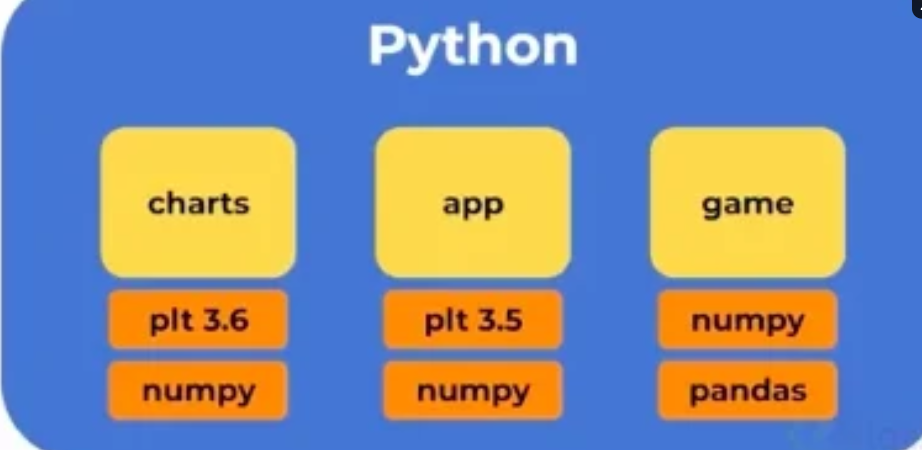
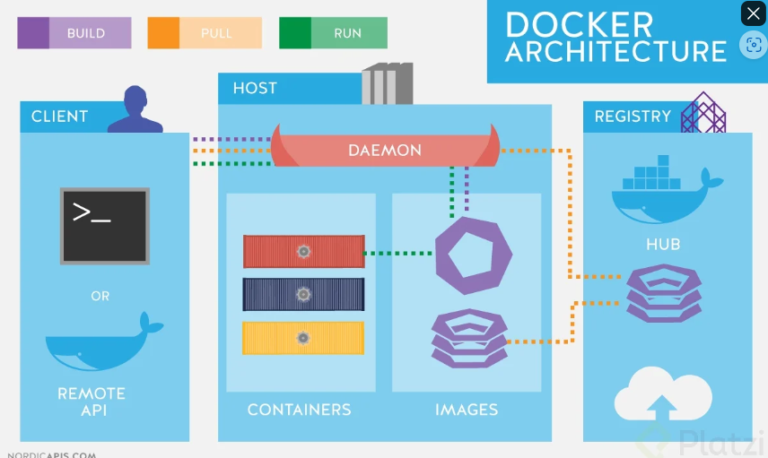

PIP

-Son las principales libreiras y frameworks que podemos utilizar en python GESTOR DE PAQUETES DE PYTHON (pyPI buscar en internet para mirar todos los paquetes de python)

1.AMBIENTES VIRTUALES

-Al manejar  diferentes lenguajes en un ambiente global (instalado en toda la maquina) puede causar problemas ya que al manejar diferentes programas 
 o proyectos que necesiten diferentes versiones esto ocasioanra que entre versiones empiezen a colapsar  
-->sin ambiente virtual
Encapsulan cada uno de los modulos y loo atan a cada proyecto  cada uno con sus propias dependencias y en sus propias versiones sin necesidad que colapsen
--con ambiente virtual

    PASOS PARA CREAR AMBIENTE VIRTUALES

**Poner cada proyecto en su propio ambiente, entrar en cada carpeta.**
    python3 -m venv env

**Activar el ambiente**
    source env/bin/activate

**salir del ambiente virtual**
    deactivate

**Podemos instalar las librerias necesarias en el ambiente virtual como por ejemplo**
    pip3 install matplotlib==3.5.0

**Verificar las instalaciones**
    pip3 freeze

2.REQUIREMENTS

-Es una forma de automatizar la instalcaion de independencias o bibliotecas sin necesidad de descargarla una por una en la terminal este se utiliza aun con el ambiente virtual (Se utiliza mas que todo cuando queremos trabajar en conjunto y deseamos que otros colaboren en nuestro proyecto)

    PASOS PARA CREAR EL ARCHIVO REQUIREMENTS

**Generar el archivo con el siguiente comando**
    pip3 freeze > requirements.txt

**Revisar lo que hay dentro del archivo**
    cat requirements.txt

**Instalar las dependencias necesarias para contribuir más rápido en proyectos**
    pip3 install -r requirements.txt

3.SOLUCIONES HTTP CON REQUEST
-Request es una libreria que nos permite hacer peticiones a otros servidores web con python 

    PASOS PARA HACER UN REQUEST A UNA PAG

***Crear un entorno**
    python3 -m venv env

***Activar un entorno virtual**
    source env/bin/activate

**Verificar que estemos dentro del entorno virtual**
    which python3
    
**Instalar la dependencia dentro del entorno virtual**
    pip3 install requests
    
**Verificar la instalacion**
    pip3 freeze

**Crear el archivo para que cualquier persona pueda desplegar el proyecto**
    pip freeze > requeriments.txt

    CODIGO

**ARCHIVO STORE**
    import requests
    def get_categories():
        r = requests.get('https://api.escuelajs.co/api/v1/categories') -->CAMBIAR EL LINK =
        print(r.status_code)
        print(r.text)
        print(type(r.text))
        categories = r.json()
        for category in categories:
            print(category['name'])

**ARCHIVO MAIN**
    import store
    def run():
        store.get_categories()
    if __name__ == '__main__':
        run()

4.PANDAS
-Es una de las librerias mas utilizadas en python y nos sirven para analizar y manipular datos de archivos duros

    PASOS PARA UTILIZAR PANDAS 

**Activar anbiente del proyecto**
    source env/bin/activate

**Verificar**
    which python3

**Ver que hay dentro del archivo en el cual se evidencia que no hay pandas**
    cat reqruirements.txt

**Agregar nueva libreria**
    pip3 install pandas

**Verificar librerias instaladas**
    pip3 freeze

**Actualizar el documento que contiene las librerias**
    pip3 freeze > requirements.txt

5.FastAPI

-Es un framework de Python para crear aplicaciones web rápidas y seguras. Utilice la mejor OpenAPI para definir la interfaz de la aplicación y proporcione un conjunto de herramientas para validar y documentar la API de manera automática.

****Uvicorn ****

Es un servidor ASGI (Asynchronous Server Gateway Interface) de alto rendimiento para ejecutar aplicaciones ASGI como FastAPI. Es una alternativa a otros servidores ASGI como Daphne y Hypercorn.

FastAPI y Uvicorn se utilizan juntos para proporcionar un entorno rápido y fácil de usar para el desarrollo y el uso de aplicaciones web basadas en ASGI.

    PASOS PARA UTILIZAR FASTAPI
**INSTALAR FASTAPI**  
    pip install fastapi

A continuación, puede comenzar a crear su primera aplicación FastAPI. Por ejemplo, aquí tienes un ejemplo de una aplicación que expone una ruta "/" que recibe una solicitud GET y devuelve un mensaje de bienvenida:

    CODIGO

from fastapi import FastAPI

app = FastAPI()

@app.get("/")
def read_root():
    return {"Hello": "World"}

if __name__ == "__main__":
    app.run()

DOCKER 
Herramienta que nos permite aislar nuestro entorno por completo cosa que no se pude hacer con los entornos virtuales vistos anteriormenete este logra su objetivo por medio de imagenes que al descargarlas y configuraralas se vuelven contenedores y por medio de estos fuciona nuestro entorno 

COMANDOS CURSO

pip3 freeze --> Librerias instaladas
which python3 --> Lugar en el que se esta ejecutando python
which pip3 --> Lugar en el que se esta ejecutando pip
sudo apt install -y python3-venv --> Instalar el ambiente virtual de python 
pip3 freeze > requirements.txt --> Convertir las librerias instaladas en un archivo txt
cat requirements.txt --> Revisar que hay dentro de un archivo (Cambiar el nombre de archivo si es necesario)
pip3 install -r requirements.txt --> Instalar las independencais de un archivo
git clone (link) --> Cloanar un repo 

MIRAR LA CLASE requirements.txt Y PONER LOS COMANDO RESTANTES
